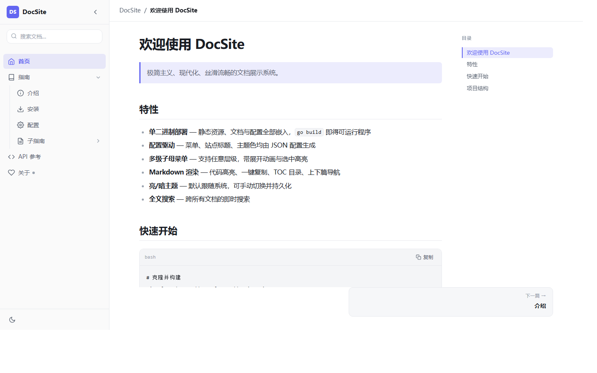
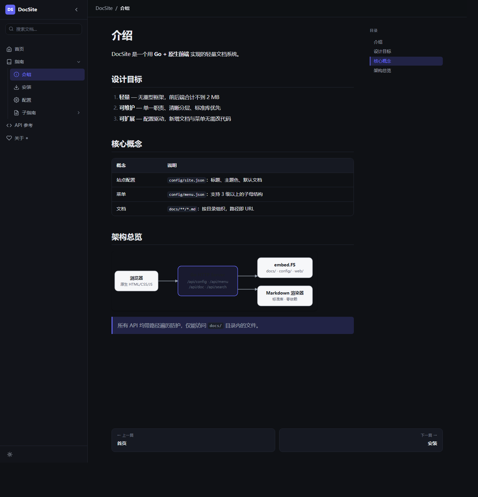
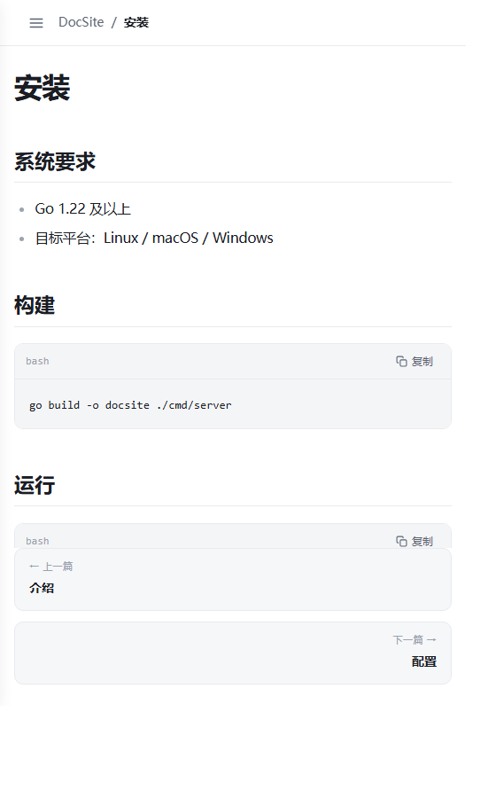

# DocSite — 极简现代文档展示系统

一个用 **Go 标准库 + 原生 HTML/CSS/JS** 实现的文档展示系统：左侧可折叠多级菜单，
点击加载 Markdown 文档，亮/暗主题、全文搜索、上下篇导航一应俱全。
配置驱动、零第三方依赖，`go build` 得到单个可执行文件。

## 界面预览

| 亮色主题 | 暗色主题 | 移动端 |
| --- | --- | --- |
|  |  |  |

---

## 特性

**侧边栏**

- 整体折叠/展开（展开显示完整菜单，折叠收窄为图标条），状态持久化到 `localStorage`
- 移动端自动切换为抽屉式，带遮罩，点击遮罩或按 `Esc` 关闭
- 宽度、主题色、圆角、动画时长全部由 CSS 变量控制

**多级菜单**

- 支持任意层级（示例含三级），父级可展开/收缩，用 `grid-template-rows` 做过渡动画
- 当前项高亮，并自动展开其所有父级
- 由 `config/menu.json` 生成，支持 `order` 排序、`icon` 图标、`expanded` 默认展开、`hidden` 隐藏
- 三种点击行为：`doc` 加载文档、`link` 打开外链、`callback` 调用前端注册的函数
- 切换文档不刷新整页（hash 路由 + `fetch`）

**Markdown**

- 标题、段落、有序/无序列表、任务列表、表格、引用、围栏代码块、图片、链接、水平线、粗体/斜体、行内代码、自动链接
- 代码块带语言标签与**一键复制**
- 标题自动生成锚点，右侧 TOC 目录随滚动高亮
- 上一篇/下一篇导航
- 全文搜索（服务端匹配，200ms 防抖，支持 `↑`/`↓`/`Enter` 键盘操作，`/` 快速聚焦）

**主题与体验**

- 亮/暗主题，默认跟随系统（`prefers-color-scheme`），可手动切换并持久化
- 大量留白、中性色、细边框、柔和阴影、8–12px 圆角
- `Inter`/`system-ui` 字体，代码用等宽字体
- 200–300ms `cubic-bezier` 过渡；内容切换淡入；加载时骨架屏；滚动条美化；平滑滚动
- 响应式适配桌面/平板/手机
- 可访问性：语义化标签、`aria-expanded`/`aria-current`、焦点样式、键盘导航，
  并遵循 `prefers-reduced-motion`（系统开启"减少动态效果"时自动关闭过渡与动画）

---

## 技术栈

| 层 | 选型 |
| --- | --- |
| 后端 | Go 1.22+，仅标准库 `net/http`，静态资源用 `embed.FS` 嵌入 |
| 前端 | 原生 HTML5 + CSS3 + ES6，无框架、无构建步骤 |
| 配置 | `config/site.json`、`config/menu.json` |
| 文档 | `docs/**/*.md`，静态资源放 `docs/assets/` |
| 部署 | 单二进制，端口通过 `-addr` 配置 |

> **关于 Markdown 渲染器**
> 原方案指定 `goldmark`。本次实现环境中 Go module proxy 不可达（无外网），
> 因此改为在 `internal/service/md.go` 中实现了一个**零依赖的标准库渲染器**，
> 覆盖上述全部语法。好处是彻底无第三方依赖、离线可构建。
> 若需换回 `goldmark`：联网后执行
> `go get github.com/yuin/goldmark@latest`，
> 再让 `getDoc` 调用 goldmark 渲染即可（`internal/service/service.go` 中
> 只有一处调用 `renderMarkdown`，替换成本很低）。

---

## 快速开始

```bash
cd docsite

# 构建（输出单文件）
go build -o ../docsite ./cmd/server

# 运行
../docsite -addr :8080
```

打开 <http://localhost:8080>。开发时可热运行：

```bash
go run ./cmd/server -addr :3000
```

运行测试：

```bash
go test ./...
```

---

## 目录结构

```
docsite/
├── embed.go                  # 根级 embed：config/ docs/ web/
├── cmd/server/main.go        # 入口，解析 -addr
├── internal/
│   ├── handler/handler.go    # 路由、静态资源、安全响应头
│   ├── service/
│   │   ├── service.go        # 配置加载、文档缓存、搜索、上下篇
│   │   ├── md.go             # 零依赖 Markdown 渲染器 + TOC 抽取
│   │   └── md_test.go        # 渲染与路径安全测试
│   └── model/model.go        # 数据结构
├── config/
│   ├── site.json             # 站点配置
│   └── menu.json             # 菜单树
├── docs/                     # Markdown 文档
│   ├── index.md
│   ├── api.md
│   ├── guide/
│   └── assets/               # 文档内图片/附件
└── web/                      # 前端（嵌入二进制）
    ├── index.html
    ├── css/                  # reset / variables / theme / layout / sidebar / content
    └── js/                   # main / router / sidebar / markdown / theme / search
```

> `embed` 指令必须放在**模块根目录**（`embed.go`），因为 `//go:embed` 的路径
> 相对于源文件所在目录解析，写在 `internal/service/` 里无法访问 `config/` 和 `docs/`。

---

## 配置

### `config/site.json`

```json
{
  "title": "DocSite",
  "description": "极简现代文档展示系统",
  "themeColor": "#6366f1",
  "defaultDoc": "index.md",
  "logoText": "DS"
}
```

- `themeColor` 会写入 CSS 变量 `--accent`
- `defaultDoc` 是首次访问加载的文档

### `config/menu.json`

```json
{
  "items": [
    {
      "id": "guide",
      "title": "指南",
      "icon": "book",
      "action": "toggle",
      "expanded": true,
      "order": 2,
      "children": [
        {
          "id": "guide-intro",
          "title": "介绍",
          "action": "doc",
          "path": "guide/intro.md",
          "order": 1
        }
      ]
    }
  ]
}
```

| 字段 | 类型 | 说明 |
| --- | --- | --- |
| `id` | string | 唯一标识 |
| `title` | string | 显示名称 |
| `icon` | string | 图标名：`home` `book` `info` `download` `settings` `code` `heart` `doc` |
| `action` | string | `doc` / `link` / `callback` / `toggle` |
| `path` | string | 文档路径（`action=doc`） |
| `url` | string | 外部链接（`action=link`） |
| `callback` | string | 前端函数名（`action=callback`） |
| `order` | int | 排序权重，越小越靠前 |
| `expanded` | bool | 默认展开 |
| `hidden` | bool | 隐藏但保留配置 |
| `children` | array | 子菜单 |

### 新增一篇文档

1. 在 `docs/` 下新建 `.md` 文件
2. 在 `config/menu.json` 中加一个 `action: "doc"` 的菜单项
3. `go build` 重新构建（配置经 `embed.FS` 编译进二进制）

### `callback` 行为示例

```js
// 注册在 window 上的函数即可被菜单调用
window.showShortcuts = () => alert("快捷键：/ 搜索");
```

---

## API

| 方法 | 路径 | 说明 |
| --- | --- | --- |
| GET | `/api/config` | 站点配置 |
| GET | `/api/menu` | 菜单树 |
| GET | `/api/doc?path=guide/intro.md` | 渲染后的文档（HTML + TOC + 上下篇） |
| GET | `/api/search?q=关键词` | 全文搜索，返回前 20 条 |
| GET | `/docs/assets/*` | 文档内静态资源 |
| GET | `/*` | 前端静态文件，无扩展名路径回退到 `index.html` |

`/api/doc` 响应：

```json
{
  "path": "guide/intro.md",
  "title": "介绍",
  "html": "<h1 id=\"介绍\">介绍</h1>...",
  "toc": [{ "level": 1, "text": "介绍", "id": "介绍" }],
  "prev": { "id": "home", "title": "首页", "path": "index.md" },
  "next": { "id": "guide-install", "title": "安装", "path": "guide/install.md" },
  "updatedAt": "2026-10-02T12:00:00Z"
}
```

### 安全

- `path` 参数会规范化：拒绝 `..`、`.`、空路径段、NUL 字节，并强制 `.md` 后缀；
  任何输入都不可能解析到 `docs/` 之外（`TestNormalizePathCannotEscape` 覆盖）
- 静态资源请求带扩展名时缺失返回 404，不会静默回退成 HTML
- 响应头带 `X-Content-Type-Options: nosniff`、`X-Frame-Options: DENY`、`Referrer-Policy: same-origin`
- Markdown 正文与代码块均做 HTML 转义，原始 HTML 不会注入

---

## 自定义外观

改 `web/css/variables.css` 即可：

```css
:root {
  --sidebar-width: 264px;   /* 侧边栏宽度 */
  --sidebar-collapsed: 60px;
  --radius: 10px;           /* 圆角 */
  --dur: 240ms;             /* 动画时长 */
  --accent: #6366f1;        /* 会被 site.json 的 themeColor 覆盖 */
}
```

暗色主题变量在 `web/css/theme.css` 的 `[data-theme="dark"]` 中。

---

## 验证情况

- `go build ./cmd/server` 通过
- `go vet ./...` 无告警
- `go test ./...`：13 个用例全部通过（标题唯一锚点、代码块转义、行内代码不被格式化、
  表格、任务列表、路径穿越不变量、配置与文档加载、404）
- HTTP 端到端：18 项检查全部通过（各 API、静态资源、SPA 回退、遍历防护、404/400）
